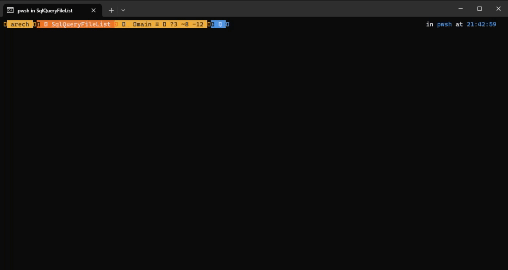

# SqlQueryFileList

> 搜索資料夾內的用 **SQL查詢** 語句來查詢

此專案是基於 [kashav/fsql](https://github.com/kashav/fsql) 的概念以 [.NET 8](https://dotnet.microsoft.com/en-us/download/dotnet) 改寫的專案。

## 欄位名稱(預設)
-   NAME
-   SIZE
-   LAST_WRITE_TIME
-   EXTENSION

## 使用方式
與[kashav/fsql](https://github.com/kashav/fsql)使用方式類似，但排除需要有查詢語句結束的分號 (**;**)

```PowerShell
SqlQueryFileList.exe select * from .
```

預設選取的**Column**為 **(*)** 時，會顯示NAME, SIZE, FILE_LAST_WRITE_TIME, EXTENSION</br>
預設選取的**Table**為 **(.)** 時，會選取 **呼叫此程式的當前位置** 的資料夾清單
</br>

例如:<br/>


預設可以將SqlQueryFileList.exe的檔案位置加入系統的環境變數中，後面可以依照當前的位置使用 **(.)** 來獲取當前資料夾的清單
